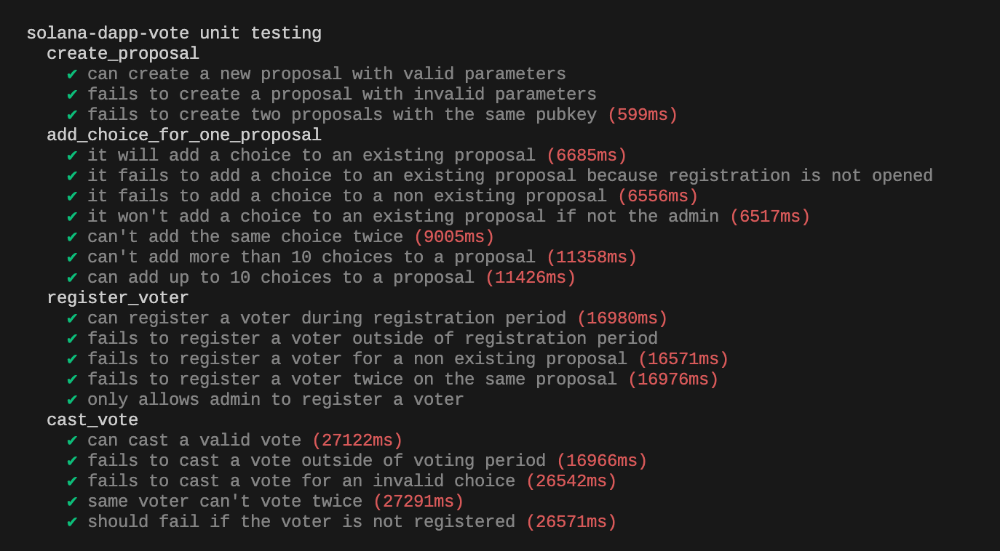
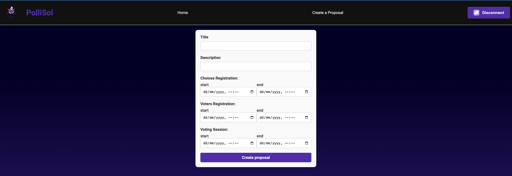

# Solana Decentralized Voting Platform

This project is a decentralized voting platform leveraging the Solana blockchain to ensure secure and transparent voting
processes. It allows for the initiation of various voting sessions that are accessible to all participants.

## 👉️ Information

- **Developers:**
  - [Sébastien Gazeau](https://github.com/SebGazeau): Frontend
  - [Maxime Auburtin](https://github.com/manthis) : Unit tests
  - [Constance Beguier](https://github.com/ConstanceBeguier): Solana Program
- **Deployed dApp Frontend:** [Link to Vercel Deployment](https://alyrasollivote.vercel.app/)
- **Program Explorer Link:** [Solscan Explorer](https://solscan.io/account/4AEtDMG3A5rFTFwj6KyA6K41dxxpagemC4CaG5w9oABc?cluster=devnet)
- **Tech Stack Used:**
  - **Frontend:** next 12.1.4, react 18.0.0
  - **Unit Tests:** mocha 9.0.3, chai 4.3.4
  - **Program:** anchor-cli 0.29.0, rustc 1.79.0
  - **Phantom Wallet**

---

## 👉️ Solana Program

### Voting Sessions

Upon the creation of a proposal, where the administrator defines the title, description, and the start and end of each
period, a voting session is created. A voting session is divided into three non-overlapping periods:

1. **Choice Registration Period:** The administrator can add choices to a proposal.
2. **Voter Registration Period:** The administrator can register voters to participate in the proposal.
3. **Voting Period:** Registered voters can cast their votes.

### Features

- **Create Proposal:** Administrator can create proposals with a title, description, and defined time periods for
  choice registration, voter registration, and voting.
- **Add Choices:** Administrator can add choices to an existing proposal during the choice registration period.
- **Register Voters:** Administrator can register a voter to participate in a proposal during the voter registration
  period.
- **Cast Vote:** Registered voters can cast their votes during the voting period.

### Usage

To use the platform, follow these steps:

1. **Create a Proposal `create_proposal`:**
    - An administrator creates a proposal by specifying the title, description, and time periods for choice
      registration, voter registration, and voting.

2. **Add Choices `add_choice_for_one_proposal`:**
    - During the choice registration period, the administrator can add multiple choices to the proposal.

3. **Register Voters `register_voter`:**
    - During the voter registration period, administrator can register a voter to participate in the proposal.

4. **Cast Votes `cast_vote`:**
   - During the voting period, each voter can vote for its choice in a proposal

### How to build

> anchor build

---

## 👉️ Unit Testing

Our smart contract has a unit test coverage above 80%

To launch tests please use the following command:
> anchor test

or:
> solana-test-validator
> anchor test --skip-local-validator

---

## 👉️ Frontend

Our frontend has been made with React and web3.js

Here is how it looks like:

### How to build

> cd app/
> yarn install && yarn build

### How to run

> yarn start
